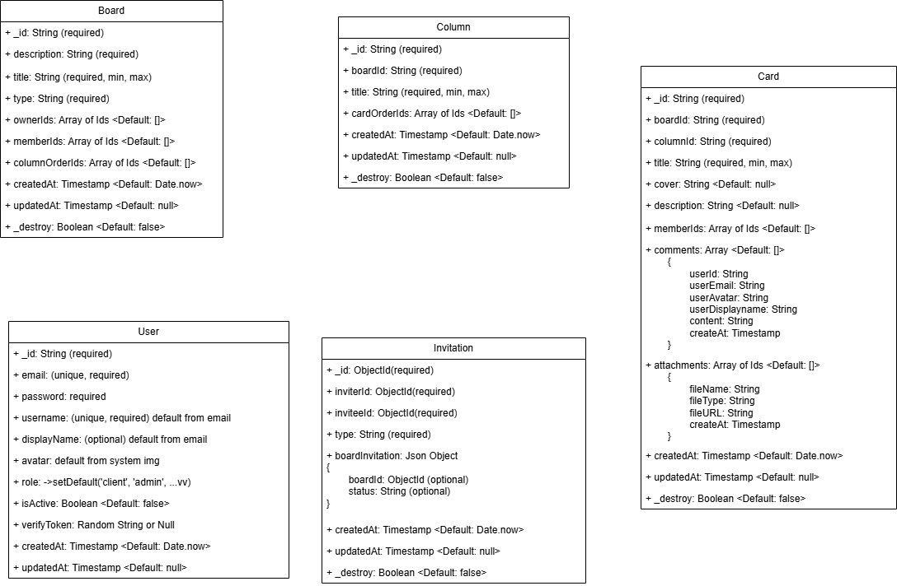

# Trello API (Express + MongoDB)

## Project UML

---

## Kiểm thử (Testing)

Tài liệu đầy đủ: [../docs/TEST_PLAN.md](../docs/TEST_PLAN.md)

### Scripts

| Lệnh | Mô tả |
|------|--------|
| `npm test` | Unit + integration + fuzz |
| `npm run test:unit` | Chỉ unit |
| `npm run test:integration` | Chỉ integration (supertest) |
| `npm run test:coverage` | Coverage HTML trong `coverage/` |
| `npm run test:fuzz` | Fuzz với fast-check |
| `npm run test:mutation` | Stryker mutation trên `src/utils` |
| `npm run lint` | Static analysis (ESLint) |

### White-box (Jest)

- `src/tests/unit/` — `authUtils`, `boardUtils`, `cardUtils`, column Joi BVA  
- Comment nhánh trong test (ví dụ `// Nhánh: password.length < 6`)  
- Coverage: utils, validations, `authMiddleware`

### Black-box (integration)

- `src/tests/integration/` — HTTP qua supertest, không cần biết implementation  
- MongoDB: `mongodb-memory-server` trong `src/tests/setup.js`  
- Email: mock `SendEmailProvider` trong test auth  

### Fuzz (nâng cao)

`src/tests/fuzz/auth.fuzz.test.js` — random input, kiểm tra contract không crash.

### Mutation (nâng cao)

Cấu hình `stryker.conf.json`. Báo cáo: `reports/mutation/mutation.html`.

### Môi trường test

`setup.js` gán JWT secrets và DB in-memory. Không cần `.env` thật khi chạy Jest.

### Export app cho test

`src/app.js` — factory Express (không listen). Integration import từ đây.
